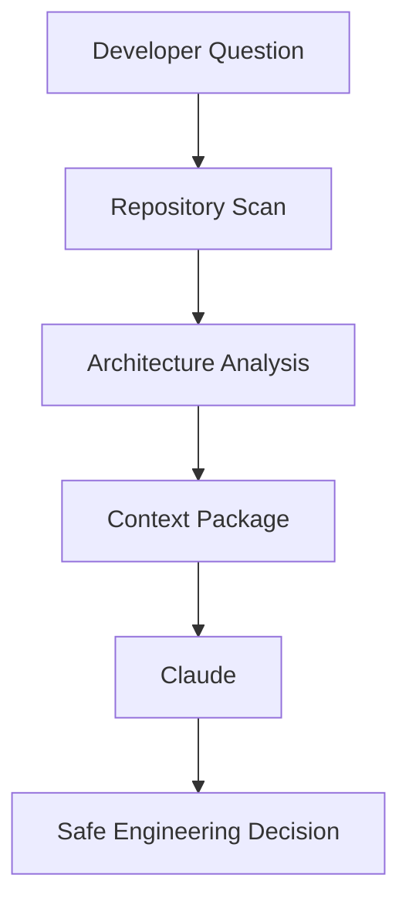

<div align="center">

# Ortho

### AI shouldn't guess. It should understand.

**Ortho helps AI understand your software before it writes code.**

[](https://github.com/ortho-ai/ortho/actions)
[](LICENSE)
[](docs/installation.md)

<br/>


</div>

---

AI coding tools generate confident code with no understanding of the system they are changing. They edit the wrong files, cross architectural boundaries, and miss the dependencies that decide whether a change is safe. Ortho is the engineering intelligence layer for AI: it reads your repository, understands its architecture, and assembles the exact context a model needs to make a safe engineering decision.

## How It Works



Three layers of understanding, one pipeline: **Repository Intelligence** → **Architecture Intelligence** → **Context Assembly**.

## Quick Start

```bash
pip install ortho
ortho init
ortho scan
```

## Example: FastAPI

Ortho pointed at the [FastAPI](https://github.com/tiangolo/fastapi) repository:

```
$ ortho scan
Indexed 978 files — symbols, imports, call graph

$ ortho analyze --architecture
Style:       layered   (confidence 0.75)
Subsystems:  21        (avg 53.4 files, no singletons)

$ ortho context --query "request routing"
Relevant files, their dependencies, and the blast radius of changing them.
```

<div align="center">

<br/><br/>

</div>

Full walkthroughs with real output: [examples/](examples/)

## What Ortho Does

| | |
|---|---|
| ✓ **Understand the Repository** | Symbols, imports, and the call graph — indexed once, queried instantly. |
| ✓ **Explain the Architecture** | Detects the structure the code actually has: layered, hexagonal, MVC, microservices, flat. |
| ✓ **Find the Right Files** | Ask a question, get the files that matter — ranked by evidence, not guesswork. |
| ✓ **Analyze Change Impact** | See what breaks before you change it. |
| ✓ **Prepare AI Context** | A ready-to-use context package for Claude or any model. |

Everything runs locally. No cloud, no telemetry, one SQLite file.

## Documentation

- [Installation](docs/installation.md)
- [Quick Start](docs/quick-start.md)
- [CLI Reference](docs/cli.md)
- [How Ortho Works](docs/architecture.md)
- [FAQ](docs/faq.md)

## Status

Working today: Python repositories, architecture detection, dependency and impact analysis, context search, CLI. See the [changelog](CHANGELOG.md) for what shipped and the [roadmap](ROADMAP.md) for what's next.

## Contributing

Bug reports, docs fixes, and PRs are welcome — see [CONTRIBUTING.md](CONTRIBUTING.md).

## License

[Apache 2.0](LICENSE)
